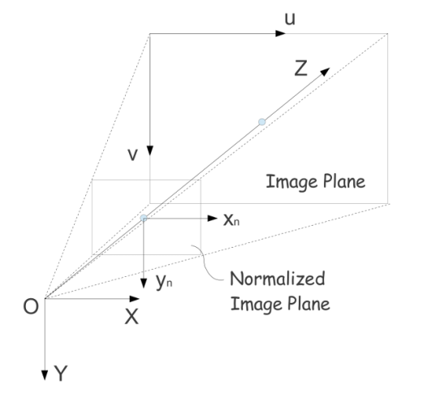

# Readme

It is the official implementation of RPnP.  
The code was previously released on http://xuchi.weebly.com/rpnp.html  
As weebly cannot be stably accessed from China, I migrate the repository to GitHub.  
The link of this repository is https://github.com/xuchi7/RPnP.git  
If you find this code useful, please cite:

[1] Shiqi Li, Chi Xu*, Ming Xie, "A Robust O(n) Solution  to the Perspective-n-Point Problem," IEEE Transactions on  Pattern Analysis and Machine Intelligence, vol. 34, no. 7, pp. 1444-1450,  July 2012, doi:10.1109/TPAMI.2012.41

```bibtex
@article{li2012robust,
    title={A Robust O (n) Solution to the Perspective-n-Point Problem},
    author={Li, S. and Xu, C. and Xie, M.},
    journal={Pattern Analysis and Machine Intelligence, IEEE Transactions on},
    volume={34},
    number={7},
    pages={1444--1450},
    year={2012}
}
```

## Related Papers

[1] Chi Xu; Lilian Zhang*; Li Cheng; R. Koch, "Pose Estimation from Line Correspondences: A Complete Analysis and A Series of Solutions," in IEEE Transactions on Pattern Analysis and Machine Intelligence, vol.PP, no.99, pp.1-1, doi: 10.1109/TPAMI.2016.2582162

[2] Shiqi Li, Chi Xu*. A Stable Direct Solution of Perspective-Three-Point Problem [J]. International Journal of Pattern Recognition and Artificial Intelligence, 2011, 25(5): 643-673

[3] Shiqi Li, Chi Xu*. Efficient Lookup Table Based Camera Pose Estimation for Augmented Reality [J]. Computer Animation and Virtual Worlds, 2011, 22(1): 47-58

[4] Lilian Zhang, Chi Xu*, Kok-Meng Lee, and Reinhard Koch. "Robust and efficient pose estimation from line correspondences." In Asian Conference on Computer Vision, pp. 217-230. Springer Berlin Heidelberg, 2012.

## Abstract

We propose a noniterative solution for the Perspective-n-Point (PnP)
problem, which can robustly retrieve the optimum by solving a seventh order
polynomial. The central idea consists of three steps: 1) to divide the reference
points into 3-point subsets in order to achieve a series of fourth order polynomials,
2) to compute the sum of the square of the polynomials so as to form a cost
function, and 3) to find the roots of the derivative of the cost function in order to
determine the optimum. The advantages of the proposed method are as follows:
First, it can stably deal with the planar case, ordinary 3D case, and quasi-singular
case, and it is as accurate as the state-of-the-art iterative algorithms with much
less computational time. Second, it is the first noniterative PnP solution that can
achieve more accurate results than the iterative algorithms when no redundant
reference points can be used (n <= 5). Third, large-size point sets can be handled
efficiently because its computational complexity is OðnÞ.

# How To Use RPnP Algorithm

The RPnP algorithm is implemented in "RPnP.m" file, its full path is "./func/RPnP.m" 
```matlab 
function [R t]= RPnP(XX,xx)  
% XX is the 3D coordinate of the point set.  
% xx is the ***normalized*** 2D coordinate of the projected point set.  
% R is the estimated rotation matrix.  
% t is the estimated translation vector.  
```

## Converting from image coordinate to normalized coordinate
The algorithm uses the normalized coordinate as input, because the normalized coordinate is independent from the camera model used. The conversion from the image coordinate to the normalized coordinate is described as follows:

(1) For a simple camera model considering only focal length and center point
As can be seen in the figure below, OXYZ is a camera coordinate frame, and its Z-axis is defined along the camera optical axis. UV is the image plane, and xnyn is the normalized image plane parallel to UV. The distance form O to the center of the image plane equals the focal length, **and the distance form O to the center of the normalized image plane equals 1**, that's why the plane is called "normalized".

Let the image coordinate be $(u,v)$, the image center be $(cu,cv)$, and the focal length is $f$, the normalized coordinates $(x_n,y_n)$ are calculated as follow:

$$  
x_n = (u - cu)/f,   
y_n = (v - cv)/f  
$$

Usually, $cu = w/2$ and $cv = h/2$, in which $w$ and $h$ are the width and height of the image respectively.



(2) For more complex camera model considering distortion and so on, please refer to:

[2] J Heikkila, O Silven. A four-step camera calibration procedure with implicit image correction, Computer Vision and Pattern Recognition. 1997

## Instructions are as follows

Please run the following files in matlab (recommended version: > R2008a)

(1) main_ordinary_3d.m
```matlab
% The experiment in the ordinary 3D case.
% noise level 3 pixels.
% number of points n= 4 ... 20
% The methods compared are DLT, EPnP, EPnP_GN, LHM and RPnP.
% Details can be found in the paper.
```

(2) main_quasi_singular.m
```matlab
% The experiment in the quasi-singular case.
% noise level 3 pixels.
% number of points n= 4 ... 20
% The methods compared are DLT, EPnP, EPnP_GN, LHM and RPnP.
```

(3) main_planar.m
```matlab
% The experiment in the planar case.
% noise level 3 pixels.
% number of points n= 4 ... 20
% The methods compared are HOMO, LHM, SP and RPnP.
% The EPnP code for planar target is not involved, because it has not been publicly released.
```

(4) main_selecting_axis.m
```matlab
% The experiment on the influence of the rotation axis selection step.
% The rotation axis is selected in different ways:
% RPnP1: randomly select an edge
% RPnP*: finding the longest in all n(n-1)/2 edges
% RPnP : the default setting which randomly semples n edge and selects the longest
```

(5) main_time.m
```matlab
% The experiment which tests the computational time.
% LHM, EPnP, EPnP_GN and RPnP are tested.
```

(6) main_4pt.m
```matlab
% The experiment in the ordinary 3D case.
% noise level 0.5 ... 5 pixels.
% number of points n= 4
% The methods compared are DLT, EPnP, EPnP_GN, LHM and RPnP.
```

(7) main_5pt.m
```matlab
% The experiment in the ordinary 3D case.
% noise level 0.5 ... 5 pixels.
% number of points n= 5
% The methods compared are DLT, EPnP, EPnP_GN, LHM and RPnP.
```

## The compared method list

(1) ./func/RPnP.m
```matlab
% The RPnP algorithm by C. Xu
% function [R t]= RPnP(XX,xx)
% XX is the 3D coordinate of the point set.
% xx is the ***normalized*** 2D coordinate of the projected point set.
% R is the estimated rotation matrix.
% t is the estimated translation vector.
```

(2) ./epnp/
```matlab
% The EPnP algorithm by F. Moreno-Noguer, V. Lepetit, P. Fua.
```

(3) ./lhm/
```matlab
% The LHM algorithm by Chien-Ping Lu et. al.
```

(4) ./sp/
```matlab
% The SP algorithm for planar targets by G. Schweighofer and A. Pinz.
```
